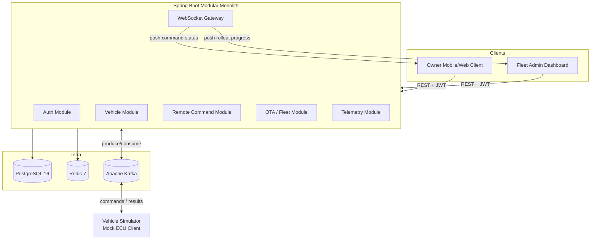

# Pulse — Connected Vehicle & Fleet OTA Platform

[](https://oracle.com/java/)
[](https://spring.io/projects/spring-boot)
[](https://kafka.apache.org/)
[](https://www.postgresql.org/)
[](https://redis.io/)
[](https://github.com/basarsy/pulse/actions/workflows/ci.yml)

**Pulse** is an enterprise-grade backend simulating a premium automaker's connected-car ecosystem (BMW-inspired). It combines **Remote Vehicle Services** (real-time vehicle status and remote commands over asynchronous channels) and **Fleet OTA Update Management** (software package releases, staged canary rollouts, and automatic safety rollbacks).

---

## 🏗️ System Architecture



---

## 🚀 Key Capabilities

- **Modular Monolith Design**: Clean package-by-feature boundaries (`auth`, `vehicle`, `command`, `ota`, `telemetry`, `messaging`, `security`, `websocket`, `common`, `config`).
- **Asynchronous Command Pattern**: Remote commands (`LOCK`, `UNLOCK`, `REMOTE_START`, etc.) are queued, dispatched via Kafka, executed asynchronously by vehicles, and pushed in real-time over STOMP WebSockets.
- **Fleet OTA Updates**: Staged rollouts (5% → 25% → 100%) with failure-rate monitoring and auto-pausing/rollback logic.
- **Role-Based Access Control (RBAC)**: Enforces granular permissions (`OWNER`, `FAMILY_MEMBER`, `DEALER_STAFF`, `FLEET_ADMIN`, `SYSTEM_ADMIN`).
- **Idempotency & Rate Limiting**: Redis-backed token buckets and key tracking to prevent command spam or duplicated dispatches.
- **Vehicle Simulator**: Dedicated mock ECU client simulating cellular latency, execution success/failure, and telemetry heartbeats.

---

## 📌 Development Roadmap & Progress

- [x] **Phase 0 — Project Setup & Baseline**
  - Spring Boot 3.3.5 scaffold & Java 21 baseline
  - Modular package structure
  - Flyway database migration baseline (`V1__init_schema.sql`)
  - Infrastructure setup (`docker-compose.yml` with Postgres 16, Redis 7, Kafka in KRaft mode)
  - Git repository initialization and GitHub remote integration
- [x] **Phase 1 — Auth & Vehicle Core**
  - User registration (`/api/v1/auth/register`) & login (`/api/v1/auth/login`) with BCrypt password hashing
  - Stateless JWT access and refresh token issuance & validation (`JwtService`, `JwtAuthenticationFilter`)
  - Role-Based Access Control (`OWNER`, `FAMILY_MEMBER`, `DEALER_STAFF`, `FLEET_ADMIN`, `SYSTEM_ADMIN`)
  - Vehicle registry CRUD & VIN uniqueness checks (`/api/v1/vehicles`)
  - SpEL method-security ownership and family member authorization (`/api/v1/vehicles/{id}/authorize`)
  - Fleet-wide vehicle management endpoint (`/api/v1/fleet/vehicles`)
  - Unit test suite for `AuthService` and `VehicleService`
- [x] **Phase 2 — Remote Command Engine**
  - Remote command state machine (`PENDING` -> `SENT` -> `ACKNOWLEDGED` -> `COMPLETED` / `FAILED` / `TIMED_OUT`)
  - Kafka command pipeline (`vehicle.commands` and `vehicle.command-results`)
  - Standalone Vehicle Simulator (v1) mocking ECU latency (1-2.5s), execution results, and heartbeats (`vehicle.heartbeat`)
  - Real-time STOMP WebSocket push channel (`/topic/vehicles/{vehicleId}/commands`)
  - Redis-backed idempotency tracking (24h TTL) and rate limiting (max 10 commands/min per user)
  - Scheduled command timeout cleanup job (`@Scheduled`)
  - Unit test suite for `CommandService` (11 total tests passing)
- [x] **Phase 3 — OTA & Fleet Rollout Engine**
  - Software version package registry (`/api/v1/software-versions`)
  - Staged canary rollout campaign state machine (`DRAFT` -> `IN_PROGRESS` -> `PAUSED` -> `COMPLETED` / `ABORTED`) with customizable stages (e.g. 5% → 25% → 100%)
  - Automated failure threshold monitoring: auto-pauses rollout if stage failure rate exceeds configurable threshold
  - Per-vehicle update status lifecycle (`PENDING` -> `DOWNLOADING` -> `DOWNLOADED` -> `INSTALLING` -> `INSTALLED` / `FAILED` -> `ROLLED_BACK`)
  - Kafka OTA instructions pipeline (`ota.vehicle-instructions` and `ota.vehicle-update-status`)
  - Real-time STOMP WebSockets streaming campaign progress to `/topic/rollouts/{campaignId}` and vehicle updates to `/topic/vehicles/{id}/update-status`
  - Vehicle Simulator (v2) with multi-step download/install simulation and failure injection
  - Unit test suite for `RolloutCampaignService` (14 total tests passing across project)
- [ ] **Phase 4 — Telemetry & Observability** (Next)
  - Telemetry ingestion pipeline
  - Resilience4j circuit breakers & retries
  - Micrometer / Prometheus / Grafana observability
- [ ] **Phase 5 — Stretch Goals**

---

## 🛠️ Tech Stack

- **Language / Framework**: Java 21, Spring Boot 3.3.5
- **Security**: Spring Security, JJWT
- **Persistence**: Spring Data JPA, PostgreSQL 16, Flyway
- **Caching & Rate Limiting**: Redis, Spring Data Redis
- **Messaging**: Apache Kafka (Spring Kafka)
- **WebSockets**: Spring WebSocket, STOMP
- **Testing**: JUnit 5, Mockito, Testcontainers
- **Containers & CI/CD**: Docker, Docker Compose, GitHub Actions (.github/workflows/ci.yml)

---

## ⚙️ Getting Started

### Prerequisites

- Java 21+
- Docker & Docker Compose

### 1. Clone the Repository

```bash
git clone https://github.com/basarsy/pulse.git
cd pulse
```

### 2. Start Infrastructure Services

Spin up PostgreSQL, Redis, and Kafka in the background:

```bash
docker compose up -d
```

### 3. Run the Backend Application

```bash
./mvnw spring-boot:run
```
*(On Windows Command Prompt / PowerShell, use `mvnw.cmd spring-boot:run`)*

---

## 📜 License

This project is open-source and available under the [MIT License](LICENSE).
