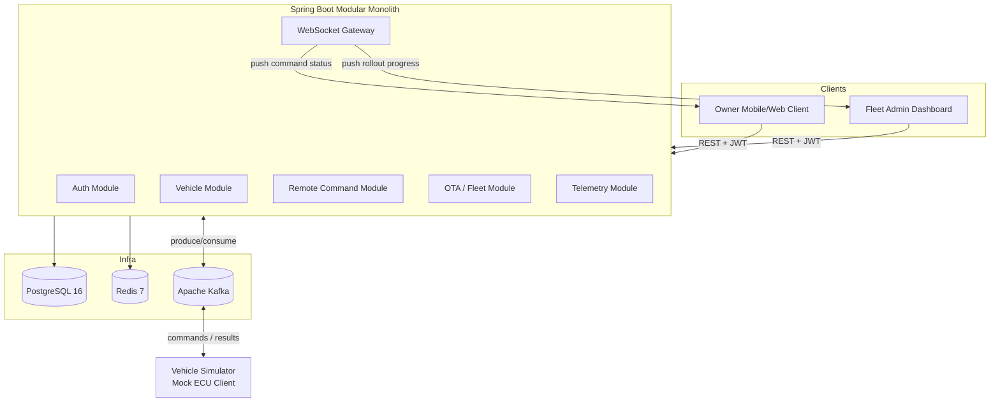

# Pulse — Connected Vehicle & Fleet OTA Platform

[](https://oracle.com/java/)
[](https://spring.io/projects/spring-boot)
[](https://kafka.apache.org/)
[](https://www.postgresql.org/)
[](https://redis.io/)

**Pulse** is an enterprise-grade backend simulating a premium automaker's connected-car ecosystem (BMW-inspired). It combines **Remote Vehicle Services** (real-time vehicle status and remote commands over asynchronous channels) and **Fleet OTA Update Management** (software package releases, staged canary rollouts, and automatic safety rollbacks).

---

## 🏗️ System Architecture



---

## 🚀 Key Capabilities

- **Modular Monolith Design**: Clean package-by-feature boundaries (`auth`, `vehicle`, `command`, `ota`, `telemetry`, `messaging`, `security`, `websocket`, `common`, `config`).
- **Asynchronous Command Pattern**: Remote commands (`LOCK`, `UNLOCK`, `REMOTE_START`, etc.) are queued, dispatched via Kafka, executed asynchronously by vehicles, and pushed in real-time over STOMP WebSockets.
- **Fleet OTA Updates**: Staged rollouts (5% → 25% → 100%) with failure-rate monitoring and auto-pausing/rollback logic.
- **Role-Based Access Control (RBAC)**: Enforces granular permissions (`OWNER`, `FAMILY_MEMBER`, `DEALER_STAFF`, `FLEET_ADMIN`, `SYSTEM_ADMIN`).
- **Idempotency & Rate Limiting**: Redis-backed token buckets and key tracking to prevent command spam or duplicated dispatches.
- **Vehicle Simulator**: Dedicated mock ECU client simulating cellular latency, execution success/failure, and telemetry heartbeats.

---

## 📌 Development Roadmap & Progress

- [x] **Phase 0 — Project Setup & Baseline**
  - Spring Boot 3.3.5 scaffold & Java 21 baseline
  - Modular package structure
  - Flyway database migration baseline (`V1__init_schema.sql`)
  - Infrastructure setup (`docker-compose.yml` with Postgres 16, Redis 7, Kafka in KRaft mode)
  - Git repository initialization and GitHub remote integration
- [ ] **Phase 1 — Auth & Vehicle Core** (Next)
  - User registration/login with JWT
  - Vehicle registry & ownership management
  - Family member access authorization
- [ ] **Phase 2 — Remote Command Engine**
  - Command state machine & Kafka command queue
  - Vehicle Simulator v1 (Commands + Heartbeats)
  - STOMP WebSocket status push
  - Redis idempotency & rate limiting
- [ ] **Phase 3 — OTA & Fleet Rollout Engine**
  - Software version registry
  - Staged rollout campaign manager & auto-pause logic
  - Vehicle Simulator v2 (Download/Install simulation)
- [ ] **Phase 4 — Telemetry & Observability**
  - Telemetry ingestion pipeline
  - Resilience4j circuit breakers & retries
  - Micrometer / Prometheus / Grafana observability
- [ ] **Phase 5 — Stretch Goals**

---

## 🛠️ Tech Stack

- **Language / Framework**: Java 21, Spring Boot 3.3.5
- **Security**: Spring Security, JJWT
- **Persistence**: Spring Data JPA, PostgreSQL 16, Flyway
- **Caching & Rate Limiting**: Redis, Spring Data Redis
- **Messaging**: Apache Kafka (Spring Kafka)
- **WebSockets**: Spring WebSocket, STOMP
- **Testing**: JUnit 5, Mockito, Testcontainers
- **Containers**: Docker, Docker Compose

---

## ⚙️ Getting Started

### Prerequisites

- Java 21+
- Docker & Docker Compose

### 1. Clone the Repository

```bash
git clone https://github.com/basarsy/pulse.git
cd pulse
```

### 2. Start Infrastructure Services

Spin up PostgreSQL, Redis, and Kafka in the background:

```bash
docker compose up -d
```

### 3. Run the Backend Application

```bash
./mvnw spring-boot:run
```
*(On Windows Command Prompt / PowerShell, use `mvnw.cmd spring-boot:run`)*

---

## 📜 License

This project is open-source and available under the [MIT License](LICENSE).
