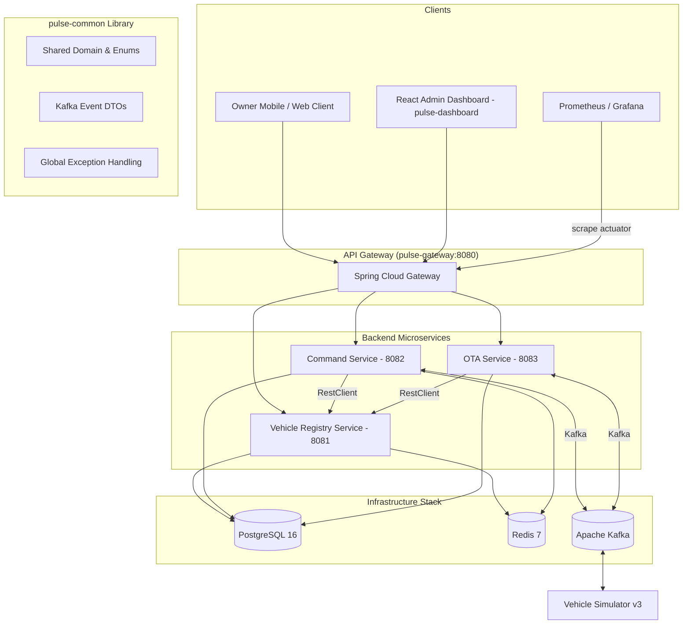

# Pulse — Connected Vehicle & Fleet OTA Platform

[](https://oracle.com/java/)
[](https://spring.io/projects/spring-boot)
[](https://spring.io/projects/spring-cloud-gateway)
[](https://react.dev/)
[](https://www.typescriptlang.org/)
[](https://vitejs.dev/)
[](https://kafka.apache.org/)
[](https://kubernetes.io/)
[](https://www.postgresql.org/)
[](https://redis.io/)
[](https://prometheus.io/)
[](https://grafana.com/)
[](https://github.com/basarsy/pulse/actions/workflows/ci.yml)

**Pulse** is an enterprise-grade connected vehicle ecosystem and fleet OTA updates platform (BMW-inspired). It combines **Remote Vehicle Services** (real-time vehicle status and remote commands over asynchronous channels), **Fleet OTA Update Management** (software package releases, staged canary rollouts, and automatic pausing when too many updates fail), **Telemetry & Observability** (real-time vehicle health ingestion, audit logging, circuit breakers, and Prometheus/Grafana monitoring), and an **Executive Fleet Dashboard** built with React & TypeScript.

---

## 🏗️ System Architecture

Pulse was built in two stages:

1. **Modular monolith (`pulse-monolith`)**: the original version. It contains all features: auth, vehicle commands, OTA rollouts, telemetry, Kafka, Redis and WebSockets.
2. **Microservices split**: an extension where the monolith was split into vehicle-registry, command and OTA services behind an API gateway, with Kubernetes manifests and a React dashboard.

The monolith is the main reference version. The microservices are a second step to compare the two styles. The diagram below shows the microservices version.


```mermaid
flowchart TB
    subgraph Clients
        A[Owner Mobile / Web Client]
        B[React Admin Dashboard - pulse-dashboard]
        PROM[Prometheus / Grafana]
    end

    subgraph Gateway["API Gateway (pulse-gateway:8080)"]
        GW[Spring Cloud Gateway]
    end

    subgraph Microservices["Backend Microservices"]
        VR[Vehicle Registry Service - 8081]
        CS[Command Service - 8082]
        OS[OTA Service - 8083]
    end

    subgraph Shared["pulse-common Library"]
        DOM[Shared Domain & Enums]
        DTO[Kafka Event DTOs]
        ERR[Global Exception Handling]
    end

    subgraph Infra["Infrastructure Stack"]
        PG[(PostgreSQL 16)]
        RD[(Redis 7)]
        KF[(Apache Kafka)]
    end

    SIM[Vehicle Simulator v3]

    A --> GW
    B --> GW
    GW --> VR
    GW --> CS
    GW --> OS
    VR --> PG
    VR --> RD
    CS --> PG
    CS --> RD
    OS --> PG
    CS <-->|Kafka| KF
    OS <-->|Kafka| KF
    KF <--> SIM
    CS -->|RestClient| VR
    OS -->|RestClient| VR
    PROM -->|scrape actuator| GW
```

---

## 🚀 Key Capabilities

- **Maven Multi-Module Architecture**: Clean decoupling into shared library (`pulse-common`), preserved monolith (`pulse-monolith`), standalone microservices (`pulse-vehicle-registry`, `pulse-command-service`, `pulse-ota-service`), and API Gateway (`pulse-gateway`).
- **Spring Cloud API Gateway**: Centralized routing, CORS management, and WebSocket forwarding on port `8080`.
- **React 18 & TypeScript Fleet Dashboard**: Premium glassmorphism UI (`pulse-dashboard`) featuring dark mode, live STOMP WebSocket push feeds, fleet status overview, interactive vehicle control panel, telemetry sparklines, and OTA campaign management.
- **Kubernetes Ready**: Comprehensive `k8s/` manifests including StatefulSets (Postgres, Kafka), Deployments (Redis, microservices, gateway, dashboard), ConfigMaps, Secrets, Horizontal Pod Autoscalers (HPA), and Nginx Ingress rules.
- **Asynchronous Command Engine**: Remote commands (`LOCK`, `UNLOCK`, `REMOTE_START`, etc.) queued and dispatched via Kafka, executed asynchronously by vehicles, and pushed in real-time over STOMP WebSockets.
- **Fleet OTA Updates**: Staged canary rollouts (5% → 25% → 100%) with failure-rate monitoring that automatically pauses the rollout if the failure rate goes over a set threshold.
- **Telemetry Ingestion Pipeline**: Real-time vehicle diagnostics (battery/fuel levels, odometer, engine temperatures, GPS coordinates) emitted by simulator, published over Kafka (`vehicle.telemetry`), and persisted in `telemetry_snapshots`.
- **Fault Tolerance & Resilience**: Resilience4j circuit breakers (`@CircuitBreaker`) and exponential retries (`@Retry`) on Kafka dispatch routines to prevent outage cascades.
- **Role-Based Access Control (RBAC)**: Enforces granular permissions (`OWNER`, `FAMILY_MEMBER`, `DEALER_STAFF`, `FLEET_ADMIN`, `SYSTEM_ADMIN`).
- **Idempotency & Rate Limiting**: Redis-backed token buckets and key tracking to prevent command spam or duplicated dispatches.
- **Vehicle Simulator v3**: Mock ECU runner generating continuous heartbeats, processing command & OTA execution stages, and periodically emitting telemetry with location drift and battery consumption.

---

## 📌 Development Roadmap & Progress

- [x] **Phase 0 — Project Setup & Baseline**
  - Spring Boot 3.3.5 scaffold & Java 21 baseline
  - Modular package structure
  - Flyway database migration baseline (`V1__init_schema.sql`)
  - Infrastructure setup (`docker-compose.yml` with Postgres 16, Redis 7, Kafka in KRaft mode)
- [x] **Phase 1 — Auth & Vehicle Core**
  - User registration (`/api/v1/auth/register`) & login (`/api/v1/auth/login`) with BCrypt password hashing
  - Stateless JWT access and refresh token issuance & validation (`JwtService`, `JwtAuthenticationFilter`)
  - Role-Based Access Control (`OWNER`, `FAMILY_MEMBER`, `DEALER_STAFF`, `FLEET_ADMIN`, `SYSTEM_ADMIN`)
  - Vehicle registry CRUD & VIN uniqueness checks (`/api/v1/vehicles`)
  - SpEL method-security ownership and family member authorization (`/api/v1/vehicles/{id}/authorize`)
  - Fleet-wide vehicle management endpoint (`/api/v1/fleet/vehicles`)
  - Unit test suite for `AuthService` and `VehicleService`
- [x] **Phase 2 — Remote Command Engine**
  - Remote command state machine (`PENDING` -> `SENT` -> `ACKNOWLEDGED` -> `COMPLETED` / `FAILED` / `TIMED_OUT`)
  - Kafka command pipeline (`vehicle.commands` and `vehicle.command-results`)
  - Standalone Vehicle Simulator (v1) mocking ECU latency (1-2.5s), execution results, and heartbeats (`vehicle.heartbeat`)
  - Real-time STOMP WebSocket push channel (`/topic/vehicles/{vehicleId}/commands`)
  - Redis-backed idempotency tracking (24h TTL) and rate limiting (max 10 commands/min per user)
  - Scheduled command timeout cleanup job (`@Scheduled`)
  - Unit test suite for `CommandService` (11 total tests passing)
- [x] **Phase 3 — OTA & Fleet Rollout Engine**
  - Software version package registry (`/api/v1/software-versions`)
  - Staged canary rollout campaign state machine (`DRAFT` -> `IN_PROGRESS` -> `PAUSED` -> `COMPLETED` / `ABORTED`) with customizable stages (e.g. 5% → 25% → 100%)
  - Automated failure threshold monitoring: auto-pauses rollout if stage failure rate exceeds configurable threshold
  - Per-vehicle update status lifecycle (`PENDING` -> `DOWNLOADING` -> `DOWNLOADED` -> `INSTALLING` -> `INSTALLED` / `FAILED` -> `ROLLED_BACK`)
  - Kafka OTA instructions pipeline (`ota.vehicle-instructions` and `ota.vehicle-update-status`)
  - Real-time STOMP WebSockets streaming campaign progress to `/topic/rollouts/{campaignId}` and vehicle updates to `/topic/vehicles/{id}/update-status`
  - Vehicle Simulator (v2) with multi-step download/install simulation and failure injection
  - Unit test suite for `RolloutCampaignService` (14 total tests passing across project)
- [x] **Phase 4 — Telemetry & Observability**
  - Telemetry Ingestion Pipeline (`/api/v1/vehicles/{id}/telemetry/latest`, `/history`)
  - Kafka Telemetry Consumer (`vehicle.telemetry`) & Vehicle Simulator v3 telemetry emission
  - Resilience4j `@CircuitBreaker` and `@Retry` on `CommandKafkaProducer` and `OtaKafkaProducer`
  - Asynchronous `@Async` Audit Logging (`AuditLogService`, `AuditLogEntry`, JSONB metadata) across Auth, Vehicle, Command, and OTA modules
  - Micrometer domain metrics (`pulse.commands.issued`, `pulse.telemetry.ingested`, etc.) and Spring Boot Actuator Prometheus endpoint (`/actuator/prometheus`)
  - Docker Compose integration with Prometheus (`port 9090`) and Grafana (`port 3000`)
  - Comprehensive unit tests (`TelemetryServiceTest`, `AuditLogServiceTest`)
- [x] **Phase 5 — Stretch Goals: Microservices, Kubernetes & React Dashboard**
  - **Sub-Phase 5A**: Maven multi-module restructuring (`pulse-common`, `pulse-monolith`)
  - **Sub-Phase 5B**: Microservices split (`pulse-vehicle-registry`, `pulse-command-service`, `pulse-ota-service`, `pulse-gateway`)
  - **Sub-Phase 5C**: Kubernetes manifests (`k8s/` directory with Deployments, StatefulSets, HPAs, and Ingress)
  - **Sub-Phase 5D**: Executive Fleet Dashboard (`pulse-dashboard` - React 18, Vite, TypeScript, CSS custom tokens, glassmorphism UI)

---

## 🛠️ Tech Stack

- **Backend**: Java 21, Spring Boot 3.3.5, Spring Cloud Gateway 2023.0.3
- **Frontend**: React 18, TypeScript 5, Vite 5, STOMP / SockJS, Vanilla CSS (Glassmorphism design system)
- **Security**: Spring Security, JJWT 0.12.6
- **Persistence**: Spring Data JPA, PostgreSQL 16, Flyway
- **Caching & Rate Limiting**: Redis 7, Spring Data Redis
- **Messaging**: Apache Kafka 3.7 (KRaft mode)
- **Fault Tolerance**: Resilience4j 2.2.0 (Circuit Breakers, Retries, AOP)
- **Observability**: Micrometer, Spring Boot Actuator, Prometheus, Grafana
- **WebSockets**: Spring WebSocket, STOMP
- **Containerization & Orchestration**: Docker, Docker Compose, Kubernetes (K8s manifests & HPA)
- **CI/CD**: GitHub Actions (.github/workflows/ci.yml)

---

## ⚙️ Getting Started

### Prerequisites

- Java 21+
- Node.js 20+
- Docker & Docker Compose

### 1. Clone the Repository

```bash
git clone https://github.com/basarsy/pulse.git
cd pulse
```

### 2a. Run the Monolith (original version)

Start the infrastructure (Postgres, Redis, Kafka, Prometheus, Grafana), then run the monolith:

```bash
docker compose up -d
./mvnw -pl pulse-monolith -am spring-boot:run
```

### 2b. Or Start the Microservices Stack via Docker Compose

Run the entire microservice ecosystem locally:

```bash
docker compose -f docker-compose.microservices.yml up -d
```

### 3. Run React Dashboard Locally

```bash
cd pulse-dashboard
npm install
npm run dev
```

Dashboard will be available at [http://localhost:5173](http://localhost:5173).

---

## 📜 License

This project is open-source and available under the [MIT License](LICENSE).
