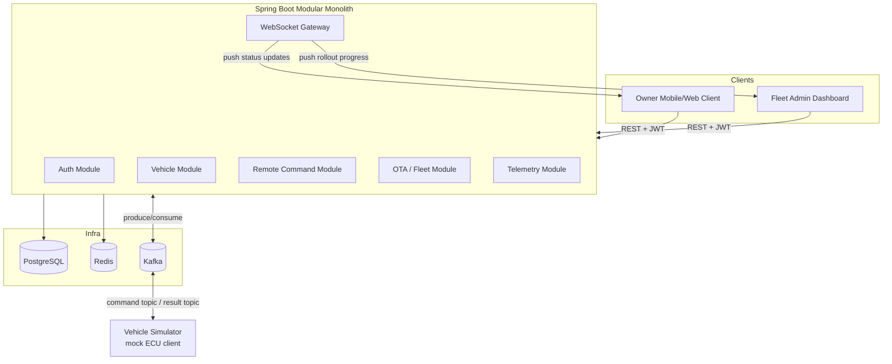

# Pulse — Connected Vehicle & Fleet OTA Platform

**Technical Specification & Build Prompt**

**Combined system:** Remote Vehicle Services (ConnectedDrive-style) + Fleet OTA Software Update Management

**Domain theme:** BMW-inspired connected car ecosystem

**Target stack:** Java 21, Spring Boot 3.3

---

## 0. Instructions for the AI Building This System

You are an expert backend engineer specializing in Java 21 and Spring Boot 3.3. Build the system described below, codenamed **Pulse**, **incrementally, phase by phase** (see Section 18 — Development Roadmap). Do not attempt to generate the entire system in one pass.

For each phase:
1. Propose the package/class structure before writing code.
2. Implement one module at a time (entities → repositories → services → controllers → tests).
3. Write unit tests for business logic (especially state machines) and integration tests for persistence/messaging.
4. Explain any architectural decision that deviates from this spec, and ask before deviating on anything security-related.

Favor a **modular monolith** (single deployable Spring Boot app, package-by-feature, clean module boundaries) over a distributed microservices setup, unless explicitly told otherwise. This keeps the project realistically buildable by one developer while still demonstrating event-driven design, state machines, caching, and RBAC — the skills that matter for a portfolio/interview project.

---

## 1. Executive Summary

**Pulse** simulates the backend of a premium automaker's connected-car ecosystem, combining two real-world systems BMW (and similar OEMs like Mercedes-Benz, Tesla, Hyundai) actually operate:

1. **Remote Vehicle Services** — owners issue remote commands to their car (lock/unlock, remote start, flash lights, locate, check charge/fuel status) through a mobile/web client. The vehicle is treated as an asynchronous, sometimes-offline device.
2. **Fleet OTA Update Management** — a fleet/software team pushes software updates to vehicles' ECUs (Electronic Control Units) over the air, with staged rollouts, health monitoring, and rollback capability.

Both systems share the same core asset (the `Vehicle`), the same security model (RBAC across owners, dealers, and fleet admins), and the same event-driven backbone (command/update requests are asynchronous, since a real vehicle isn't always connected).

---

## 2. Project Scope

### 2.1 In Scope
- User authentication & authorization (JWT, RBAC)
- Vehicle registration & ownership management
- Remote command issuance, tracking, and asynchronous result delivery (WebSocket push)
- A **vehicle simulator** (mock ECU client) that behaves like a real connected car — since no physical BMW is available
- OTA software package management
- Staged rollout campaigns (canary-style: 5% → 25% → 100%)
- Per-vehicle update lifecycle tracking with rollback
- Audit logging of all commands and update actions
- Basic telemetry ingestion (battery/fuel level, odometer, last-known GPS) to make vehicle state realistic

### 2.2 Out of Scope (explicitly, to keep the project achievable)
- Real vehicle hardware / CAN bus integration
- Real GPS/mapping providers (mock coordinates are fine)
- Payment/billing
- Full microservices split (mentioned only as a Phase 5 stretch goal)
- Mobile app UI (a simple REST/WebSocket client or Postman collection is enough to demo)

---

## 3. System Overview & Architecture

### 3.1 High-Level Architecture



### 3.2 Architectural Style
- **Modular monolith**, package-by-feature (not package-by-layer), so each module (`vehicle`, `command`, `ota`, `telemetry`, `auth`) owns its entities, repository, service, and controller.
- **Asynchronous command pattern**: every remote command or OTA instruction is never executed synchronously against "the vehicle." It's persisted as a `PENDING` record, published to Kafka, and the simulator (acting as the vehicle) consumes it, waits a realistic delay, then publishes a result — mimicking real cellular/latency conditions of an actual car.
- **Event-driven core**: Kafka is the backbone connecting the backend and the vehicle simulator, decoupling "asking the car to do something" from "the car actually doing it."
- **Real-time push**: WebSocket (STOMP over SockJS, or plain WebSocket) delivers command/rollout status changes to clients instantly instead of requiring polling.

### 3.3 Module Breakdown

| Module | Responsibility |
|---|---|
| `auth` | User registration/login, JWT issuance, role management |
| `vehicle` | Vehicle registry, ownership, connectivity state |
| `command` | Remote command issuance, state machine, result handling |
| `ota` | Software packages, rollout campaigns, per-vehicle update state |
| `telemetry` | Ingesting and storing basic vehicle health/status data |
| `simulator` | Standalone runnable component (or separate small app) simulating one or many vehicles |
| `security` | JWT filter, RBAC annotations, ownership guards |
| `messaging` | Kafka producer/consumer configuration, topic constants |
| `common` | Shared DTOs, exceptions, base entities, audit logging |

---

## 4. Technology Stack

| Concern | Technology |
|---|---|
| Language / Runtime | Java 21 |
| Framework | Spring Boot 3.3 |
| Web layer | Spring Web (REST), Spring WebSocket |
| Security | Spring Security 6, JJWT or Nimbus JOSE for JWT |
| Persistence | Spring Data JPA + PostgreSQL |
| Migrations | Flyway |
| Caching / real-time state | Redis (Spring Data Redis) |
| Messaging / event bus | Apache Kafka (Spring Kafka) |
| Resilience | Resilience4j (circuit breaker, retry on command dispatch) |
| Rate limiting | Bucket4j + Redis |
| API documentation | springdoc-openapi (Swagger UI) |
| Build tool | Maven |
| Containerization | Docker, Docker Compose |
| CI/CD | GitHub Actions |
| Testing | JUnit 5, Mockito, Testcontainers (Postgres, Kafka, Redis) |
| Observability | Spring Boot Actuator, Micrometer, Prometheus, Grafana |
| Code quality | Checkstyle or Spotless |

> Note: This is deliberately the same family of tools you already used in Skyline (Spring Boot 3.3, Java 21, JWT+RBAC, Redis, GitHub Actions CI), extended with Kafka and WebSocket, which are the two genuinely new skills this project should demonstrate.

---

## 5. Domain Model

### 5.1 Core Entities

**User**
- `id`, `email`, `passwordHash`, `fullName`, `createdAt`
- `roles: Set<Role>`

**Role** (enum or entity): `OWNER`, `FAMILY_MEMBER`, `DEALER_STAFF`, `FLEET_ADMIN`, `SYSTEM_ADMIN`

**Vehicle**
- `id`, `vin` (unique), `model` (e.g. "BMW iX xDrive50"), `modelYear`, `currentSoftwareVersion`
- `connectivityState`: `ONLINE`, `OFFLINE`, `SLEEPING`
- `ownerId` (User), `authorizedUserIds: Set<User>` (family members who can also send commands)
- `lastKnownLatitude`, `lastKnownLongitude`, `lastSeenAt`
- `batteryOrFuelLevel`, `odometerKm`

**RemoteCommand**
- `id`, `vehicleId`, `issuedByUserId`, `type` (`LOCK`, `UNLOCK`, `REMOTE_START`, `FLASH_LIGHTS`, `LOCATE`, `CLIMATE_ON`, `CHECK_STATUS`)
- `status`: `PENDING`, `SENT`, `ACKNOWLEDGED`, `COMPLETED`, `FAILED`, `TIMED_OUT`
- `requestedAt`, `resolvedAt`, `resultMessage`
- `idempotencyKey` (to prevent duplicate command execution on retry)

**SoftwareVersion**
- `id`, `versionLabel` (e.g. "2026.07.1"), `releaseNotes`, `checksumSha256`, `packageUrl`, `mandatory: boolean`

**RolloutCampaign**
- `id`, `softwareVersionId`, `targetModel`, `createdByUserId`
- `status`: `DRAFT`, `IN_PROGRESS`, `PAUSED`, `COMPLETED`, `ABORTED`
- `stages: List<RolloutStage>` (e.g. 5% → 25% → 100%)
- `currentStageIndex`, `failureThresholdPercent` (auto-pause if failures exceed this)

**RolloutStage**
- `id`, `campaignId`, `percentage`, `startedAt`, `completedAt`, `status`

**VehicleUpdateStatus** (per-vehicle, per-campaign)
- `id`, `vehicleId`, `campaignId`, `targetVersionId`
- `status`: `PENDING`, `DOWNLOADING`, `DOWNLOADED`, `INSTALLING`, `INSTALLED`, `FAILED`, `ROLLED_BACK`
- `progressPercent`, `startedAt`, `completedAt`, `errorMessage`

**TelemetrySnapshot** (optional/simplified)
- `id`, `vehicleId`, `recordedAt`, `batteryOrFuelLevel`, `odometerKm`, `engineTempC` (mock), `latitude`, `longitude`

**AuditLogEntry**
- `id`, `actorUserId`, `action`, `targetType`, `targetId`, `timestamp`, `metadata (JSON)`

### 5.2 Entity Relationship Overview

```
User (1) ──owns──> (N) Vehicle
User (N) ──authorized on──> (N) Vehicle   [family members]
Vehicle (1) ──> (N) RemoteCommand
Vehicle (1) ──> (N) VehicleUpdateStatus
Vehicle (1) ──> (N) TelemetrySnapshot
RolloutCampaign (1) ──> (N) RolloutStage
RolloutCampaign (1) ──> (N) VehicleUpdateStatus
SoftwareVersion (1) ──> (N) RolloutCampaign
```

---

## 6. State Machines

### 6.1 Vehicle Connectivity State

| From | Event | To |
|---|---|---|
| OFFLINE | vehicle simulator sends heartbeat | ONLINE |
| ONLINE | no heartbeat for N seconds | OFFLINE |
| ONLINE | idle timeout | SLEEPING |
| SLEEPING | command received | ONLINE (wakes up) |

### 6.2 Remote Command Lifecycle

```
PENDING --(published to Kafka)--> SENT --(vehicle acks)--> ACKNOWLEDGED
   --(vehicle executes + reports result)--> COMPLETED
   --(vehicle reports error)--> FAILED
   --(no response within timeout)--> TIMED_OUT
```

Rules:
- Only `PENDING` and `SENT` commands can be cancelled.
- A `FAILED` or `TIMED_OUT` command can be retried, generating a **new** command with the same `idempotencyKey` root but incremented attempt count.
- If vehicle `connectivityState == OFFLINE`, a command stays `PENDING` and is queued for dispatch the moment the vehicle reconnects.

### 6.3 OTA Rollout Campaign Lifecycle

```
DRAFT --(admin starts)--> IN_PROGRESS
IN_PROGRESS --(stage failure rate > threshold)--> PAUSED
PAUSED --(admin resumes)--> IN_PROGRESS
PAUSED --(admin aborts)--> ABORTED
IN_PROGRESS --(all stages complete)--> COMPLETED
```

Staged rollout logic:
1. Campaign starts at stage 1 (e.g. 5% of eligible vehicles, randomly or by criteria).
2. Each vehicle in the stage gets a `VehicleUpdateStatus` record and a Kafka message is sent to that vehicle.
3. Backend monitors the failure rate within the active stage.
4. If failure rate stays below `failureThresholdPercent` and the stage completes → auto-advance to next stage.
5. If failure rate exceeds threshold → auto-pause the campaign and notify `FLEET_ADMIN` via WebSocket.

### 6.4 Per-Vehicle Update Lifecycle

```
PENDING --> DOWNLOADING --> DOWNLOADED --> INSTALLING --> INSTALLED
                                                  \--> FAILED --> ROLLED_BACK
```

---

## 7. API Design

All endpoints are versioned under `/api/v1`.

### 7.1 Auth & User Management
| Method | Endpoint | Description | Roles |
|---|---|---|---|
| POST | `/api/v1/auth/register` | Register new user | Public |
| POST | `/api/v1/auth/login` | Login, returns JWT | Public |
| POST | `/api/v1/auth/refresh` | Refresh access token | Authenticated |
| GET | `/api/v1/users/me` | Current user profile | Authenticated |

### 7.2 Vehicle Management
| Method | Endpoint | Description | Roles |
|---|---|---|---|
| POST | `/api/v1/vehicles` | Register a vehicle (VIN, model) | OWNER, DEALER_STAFF |
| GET | `/api/v1/vehicles/{id}` | Get vehicle details/state | Owner, authorized family member |
| GET | `/api/v1/vehicles` | List my vehicles | Authenticated |
| POST | `/api/v1/vehicles/{id}/authorize` | Grant a family member access | OWNER |
| GET | `/api/v1/fleet/vehicles` | List all vehicles (fleet-wide) | FLEET_ADMIN |

### 7.3 Remote Command Service
| Method | Endpoint | Description | Roles |
|---|---|---|---|
| POST | `/api/v1/vehicles/{id}/commands` | Issue a remote command | Owner, authorized user |
| GET | `/api/v1/vehicles/{id}/commands/{commandId}` | Get command status | Owner, authorized user |
| GET | `/api/v1/vehicles/{id}/commands` | Command history | Owner, authorized user |
| DELETE | `/api/v1/commands/{commandId}` | Cancel a pending command | Owner |

### 7.4 OTA / Fleet Management
| Method | Endpoint | Description | Roles |
|---|---|---|---|
| POST | `/api/v1/software-versions` | Register new software version | FLEET_ADMIN |
| POST | `/api/v1/rollouts` | Create rollout campaign (draft) | FLEET_ADMIN |
| POST | `/api/v1/rollouts/{id}/start` | Start campaign | FLEET_ADMIN |
| POST | `/api/v1/rollouts/{id}/pause` | Pause campaign | FLEET_ADMIN |
| POST | `/api/v1/rollouts/{id}/resume` | Resume campaign | FLEET_ADMIN |
| POST | `/api/v1/rollouts/{id}/abort` | Abort campaign | FLEET_ADMIN |
| GET | `/api/v1/rollouts/{id}` | Campaign status + stage progress | FLEET_ADMIN |
| GET | `/api/v1/rollouts/{id}/vehicles` | Per-vehicle update statuses | FLEET_ADMIN |
| GET | `/api/v1/vehicles/{id}/update-status` | Current vehicle's update status | Owner, FLEET_ADMIN |

### 7.5 Telemetry (optional)
| Method | Endpoint | Description | Roles |
|---|---|---|---|
| POST | `/api/v1/vehicles/{id}/telemetry` | Simulator pushes telemetry | Internal/simulator |
| GET | `/api/v1/vehicles/{id}/telemetry/latest` | Latest snapshot | Owner |

### 7.6 WebSocket / Real-Time Channels
| Destination | Purpose |
|---|---|
| `/topic/vehicles/{vehicleId}/commands` | Push command status changes to the owner |
| `/topic/vehicles/{vehicleId}/update-status` | Push OTA update progress to the owner |
| `/topic/rollouts/{campaignId}` | Push rollout-wide progress to fleet admins |

---

## 8. Security & RBAC

### 8.1 JWT Structure (example payload)

```json
{
  "sub": "user-uuid-1234",
  "email": "basar@example.com",
  "roles": ["OWNER"],
  "vehicleScopes": ["vehicle-uuid-a", "vehicle-uuid-b"],
  "iat": 1752900000,
  "exp": 1752903600
}
```

### 8.2 Roles & Permission Matrix

| Action | OWNER | FAMILY_MEMBER | DEALER_STAFF | FLEET_ADMIN | SYSTEM_ADMIN |
|---|---|---|---|---|---|
| Register vehicle | ✅ | ❌ | ✅ | ❌ | ✅ |
| Send remote command | ✅ (own vehicle) | ✅ (if authorized) | ❌ | ❌ | ✅ |
| View vehicle status | ✅ | ✅ | ✅ (own dealership) | ✅ (fleet-wide) | ✅ |
| Create rollout campaign | ❌ | ❌ | ❌ | ✅ | ✅ |
| Start/pause/abort rollout | ❌ | ❌ | ❌ | ✅ | ✅ |
| Manage users/roles | ❌ | ❌ | ❌ | ❌ | ✅ |

### 8.3 Ownership & Scoping Rules
- Every `RemoteCommand` request must verify the caller is either the vehicle's `ownerId` or in `authorizedUserIds`.
- Implement this as a `@PreAuthorize` SpEL expression or a custom method-security annotation (e.g. `@RequireVehicleAccess`) backed by a service that checks ownership against the DB (not just the JWT scopes, since scopes can go stale — treat JWT scopes as a fast-path hint, DB as source of truth).

---

## 9. Event-Driven Architecture (Kafka)

### 9.1 Topics

| Topic | Producer | Consumer | Purpose |
|---|---|---|---|
| `vehicle.commands` | Backend | Vehicle Simulator | Dispatch remote commands |
| `vehicle.command-results` | Vehicle Simulator | Backend | Command execution results |
| `ota.vehicle-instructions` | Backend | Vehicle Simulator | Push update instructions per vehicle |
| `ota.vehicle-update-status` | Vehicle Simulator | Backend | Update progress/result per vehicle |
| `vehicle.telemetry` | Vehicle Simulator | Backend | Periodic health/status data |
| `vehicle.heartbeat` | Vehicle Simulator | Backend | Connectivity state updates |

### 9.2 Message Schema Example — `vehicle.commands`

```json
{
  "commandId": "cmd-uuid",
  "vehicleId": "vehicle-uuid",
  "type": "UNLOCK",
  "issuedAt": "2026-07-19T10:15:00Z",
  "idempotencyKey": "idem-key-uuid"
}
```

### 9.3 Consumer Groups
- Backend consumer group: `backend-service-group` (consumes results/telemetry/heartbeat topics).
- Simulator consumer group: `vehicle-simulator-group` (consumes commands/instructions topics), partitioned by `vehicleId` so a given simulated vehicle always processes its own messages in order.

---

## 10. Caching Strategy (Redis)

| Key pattern | Value | TTL | Purpose |
|---|---|---|---|
| `vehicle:state:{vehicleId}` | connectivity state + last known status | 5 min | Fast reads for dashboards without hitting Postgres |
| `command:idempotency:{key}` | command id | 24h | Prevent duplicate command submission |
| `ratelimit:commands:{userId}` | token bucket | rolling | Prevent command spam (e.g. max 10 commands/min per user) |
| `rollout:progress:{campaignId}` | cached stage progress % | 30s | Avoid recomputing aggregate stats on every dashboard poll |

---

## 11. Database Schema Sketch (key tables)

```
users(id, email, password_hash, full_name, created_at)
roles(id, name)
user_roles(user_id, role_id)
vehicles(id, vin, model, model_year, owner_id, connectivity_state,
         current_software_version, last_seen_at, battery_or_fuel_level,
         odometer_km, last_lat, last_lng)
vehicle_authorized_users(vehicle_id, user_id)
remote_commands(id, vehicle_id, issued_by, type, status, requested_at,
                resolved_at, result_message, idempotency_key)
software_versions(id, version_label, release_notes, checksum, package_url, mandatory)
rollout_campaigns(id, software_version_id, target_model, status,
                   current_stage_index, failure_threshold_percent, created_by)
rollout_stages(id, campaign_id, percentage, status, started_at, completed_at)
vehicle_update_status(id, vehicle_id, campaign_id, target_version_id,
                       status, progress_percent, started_at, completed_at, error_message)
telemetry_snapshots(id, vehicle_id, recorded_at, battery_or_fuel_level,
                     odometer_km, engine_temp_c, lat, lng)
audit_log(id, actor_user_id, action, target_type, target_id, timestamp, metadata)
```

Use Flyway migrations (`V1__init.sql`, `V2__...`) — never rely on `hibernate.ddl-auto=update` beyond local prototyping.

---

## 12. Vehicle Simulator (Mock ECU Client)

Since there's no real BMW hardware, this component is **essential** to make the whole system demoable end-to-end. Build it as a small standalone Spring Boot (or plain Java) application that:

1. Registers itself as one or more virtual vehicles on startup (matching VINs already seeded in the DB).
2. Sends periodic heartbeats to `vehicle.heartbeat`.
3. Consumes `vehicle.commands`: waits a randomized 1–5 second delay (simulating cellular latency), then publishes a result to `vehicle.command-results` — occasionally simulating a failure (e.g. 5% failure rate) to make the system realistic and testable.
4. Consumes `ota.vehicle-instructions`: simulates a multi-step download → install process (publishing incremental progress to `ota.vehicle-update-status` over ~10–30 seconds), occasionally simulating an install failure to test the rollback and failure-threshold logic.
5. Periodically publishes fake telemetry (slowly draining battery/fuel, incrementing odometer).

This component is what turns the project from "a CRUD app with fancy names" into "a believable simulation of a real connected-car backend" — it's worth as much engineering attention as the backend itself.

---

## 13. Resilience & Non-Functional Requirements

- **Command dispatch resilience**: wrap Kafka publish calls with Resilience4j retry + circuit breaker; if Kafka is down, commands stay `PENDING` and a scheduled job retries dispatch.
- **Timeout handling**: a scheduled job marks commands as `TIMED_OUT` if no result arrives within e.g. 60 seconds.
- **Idempotency**: command submission endpoint accepts a client-generated idempotency key to avoid duplicate commands from retries/double-taps.
- **Rate limiting**: prevent a single user from flooding commands.
- **Observability**: expose Actuator health/metrics; track custom metrics like `commands.completed.count`, `commands.failed.count`, `rollout.failure.rate` via Micrometer.
- **Security**: all endpoints behind JWT except `/auth/**`; passwords hashed with BCrypt; secrets via environment variables, never hardcoded.

---

## 14. Testing Strategy

- **Unit tests**: state machine transition logic (commands, rollout campaigns, vehicle update status) — these are the highest-value tests since they encode business rules.
- **Integration tests** (Testcontainers): full flow with real Postgres, Kafka, Redis containers — e.g. "issue command → simulator responds → status updates → WebSocket message sent."
- **Security tests**: verify a `FAMILY_MEMBER` without authorization cannot command a vehicle they're not linked to; verify role-gated endpoints reject wrong roles with 403.
- **Contract tests**: validate Kafka message schemas between backend and simulator don't silently drift.

---

## 15. CI/CD Pipeline (GitHub Actions)

Suggested stages:
1. **Build** — `mvn clean compile`
2. **Test** — `mvn test` (with Testcontainers, so CI runner needs Docker-in-Docker)
3. **Lint/Format check** — Checkstyle or Spotless
4. **Package** — `mvn package`, build Docker image
5. **(Optional) Push image** — to GitHub Container Registry
6. **(Optional) Security scan** — Trivy or `mvn dependency-check`

---

## 16. Deployment & Local Dev Setup

`docker-compose.yml` should include:
- `postgres` (with a seed script creating a few demo vehicles/users)
- `redis`
- `kafka` + `zookeeper` (or KRaft mode, no Zookeeper needed for modern Kafka)
- `backend` (the Spring Boot app)
- `vehicle-simulator` (the mock ECU client)
- optionally `prometheus` + `grafana` for metrics dashboards

This lets you run `docker compose up` and have a fully working demo — backend, simulator, and a "fleet" of fake connected cars — which is a strong thing to show in an interview or on LinkedIn (a recorded terminal/GIF of commands flowing through the whole stack is very compelling).

---

## 17. Suggested Package Structure

```
com.pulse.connected
 ├── auth/            (User, Role, AuthController, JwtService)
 ├── vehicle/          (Vehicle, VehicleController, VehicleService, ownership checks)
 ├── command/          (RemoteCommand, state machine, CommandController, CommandService)
 ├── ota/               (SoftwareVersion, RolloutCampaign, RolloutStage, VehicleUpdateStatus)
 ├── telemetry/        (TelemetrySnapshot, ingestion endpoint)
 ├── messaging/        (Kafka producer/consumer configs, topic constants, message DTOs)
 ├── security/          (JWT filter, SecurityConfig, @RequireVehicleAccess)
 ├── websocket/        (STOMP config, push services)
 ├── common/            (BaseEntity, exceptions, AuditLogEntry, GlobalExceptionHandler)
 └── config/            (App-wide beans, Redis config, OpenAPI config)
```

Separate Maven module (or fully separate repo) for `vehicle-simulator`.

---

## 18. Development Roadmap (Phases)

**Phase 0 — Project Setup**
Spring Boot project scaffold, Docker Compose (Postgres/Redis/Kafka), Flyway baseline, CI skeleton.

**Phase 1 — Auth & Vehicle Core**
User registration/login, JWT issuance, RBAC roles, Vehicle CRUD, ownership model, authorized-family-member flow.

**Phase 2 — Remote Command Engine**
Command state machine, Kafka producer for commands, vehicle simulator v1 (commands + heartbeat only), WebSocket push of command status, idempotency + rate limiting.

**Phase 3 — OTA & Fleet Rollout Engine**
Software version registry, rollout campaign creation, staged rollout logic, per-vehicle update state machine, simulator v2 (download/install simulation + failure injection), auto-pause on failure threshold.

**Phase 4 — Telemetry & Observability**
Telemetry ingestion, Actuator/Prometheus/Grafana dashboards, audit logging, resilience hardening (retries, circuit breakers, timeout jobs).

**Phase 5 — Stretch Goals**
Split into microservices (command-service, ota-service, vehicle-registry) with API gateway; Kubernetes manifests; a minimal React/Vue dashboard frontend; push notifications (simulated) to a "mobile app."

---

## 19. Sample End-to-End Flows

**Flow A — Owner locks their car remotely**
1. Owner calls `POST /api/v1/vehicles/{id}/commands` with `{ "type": "LOCK" }`.
2. Backend verifies ownership, creates `RemoteCommand` (`PENDING`), publishes to `vehicle.commands`.
3. Vehicle Simulator consumes the message, waits ~2s, publishes result to `vehicle.command-results`.
4. Backend consumer updates `RemoteCommand` to `COMPLETED`, pushes WebSocket update to `/topic/vehicles/{id}/commands`.
5. Owner's client receives the push instantly — no polling needed.

**Flow B — Fleet admin rolls out a software update**
1. Admin registers a new `SoftwareVersion` and creates a `RolloutCampaign` (`DRAFT`) targeting a specific model.
2. Admin calls `POST /rollouts/{id}/start` → campaign moves to `IN_PROGRESS`, stage 1 (5%) selected.
3. Backend creates `VehicleUpdateStatus(PENDING)` for each vehicle in the stage and publishes to `ota.vehicle-instructions`.
4. Simulator simulates download → install over ~20s per vehicle, publishing progress to `ota.vehicle-update-status`.
5. Backend aggregates stage results; if failure rate < threshold, auto-advances to stage 2 (25%), and so on until `COMPLETED`.
6. Fleet admin dashboard receives live progress via `/topic/rollouts/{campaignId}`.

---

## 20. Appendix

### Suggested demo seed data
- 5–10 fake vehicles (mix of BMW model names, e.g. "BMW iX xDrive50", "BMW 3 Series 320i", "BMW i4 eDrive40")
- 3–4 demo users: one `OWNER`, one `FAMILY_MEMBER` linked to the owner's vehicle, one `FLEET_ADMIN`, one `SYSTEM_ADMIN`
- 2 software versions to demo an upgrade path (e.g. "2026.06.2" → "2026.07.1")

### Things worth highlighting in a README / LinkedIn writeup
- The asynchronous command pattern and why a "smart device that isn't always connected" needs it
- The staged-rollout / auto-pause-on-failure logic, since this mirrors real deployment safety practices (same idea as canary deployments in DevOps)
- The vehicle simulator, since it demonstrates you understood the need to make an untestable system (no real car) testable and demoable
